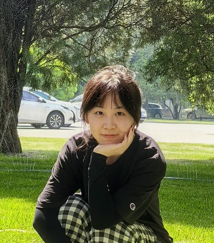

|  | 关于我 About me  目前就读于南开大学人工智能学院控制科学与工程（人工智能方向），师从孙明竹教授，研究方向为 计算机视觉、医学影像分割。本科就读于太原理工大学计算机科学与技术学院（大数据学院）人工智 能专业。  I'm a Master student in Nankai University(ROMIOL, Robotic Micro-nano Operation Laboratory) under the supervision of Prof.Mingzhu Sun, who is an expert in the field of Micro-Manipulation Robot and Computer Vision. I have got my B.S. Degree at Tai- yuan University of Technology. My research interest includes Computer Vision and  Deep Learning.  联系方式 Connect with me  2120240566 AT mail DOT Nankai DOT edu DOT cn |
| --------------------------------------------- | :------------------------------------------------------------------------------------------------------------------------------------------------------------------------------------------------------------------------------------------------------------------------------------------------------------------------------------------------------------------------------------------------------------------------------------------------------------------------------------------------------------------------------------------------------------------------------------------------------------------------------------------------------------------------------------------------------------------ |
